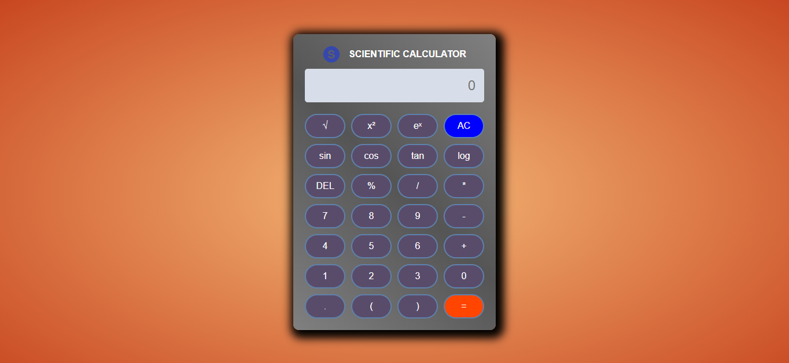

# Calculator

A simple, responsive calculator built using HTML, CSS, and JavaScript. This project demonstrates fundamental web development concepts and provides a functional calculator for basic arithmetic operations.

## Features

- Perform basic arithmetic operations: addition, subtraction, multiplication, and division.
- User-friendly and intuitive interface.
- Responsive design for usability on various devices.
- Clear button to reset calculations.

## Technologies Used

- **HTML**: For creating the structure of the calculator.
- **CSS**: For styling the calculator and ensuring responsiveness.
- **JavaScript**: For implementing the calculator's functionality.

## How to Use

1. Clone the repository or download the source files.
2. Open the `index.html` file in your preferred web browser.
3. Use the on-screen buttons to perform calculations:
   - Click on the numbers and operation buttons to input your calculation.
   - Click the `=` button to view the result.
   - Use the `C` button to clear the input and start fresh.

## Project Structure
calculator/ 
├── index.html # Main HTML file for the calculator 
├── style.css # CSS file for styling the calculator 
├── script.js # JavaScript file for the calculator's logic 
└── README.md # Project documentation

## Screenshot

## Future Enhancements

- Add support for advanced operations like square roots and exponents.
- Implement keyboard support for input.
- Include a history log for past calculations.

## Contributing

Contributions are welcome! If you'd like to improve this project, feel free to fork the repository and submit a pull request.

## License

This project is licensed under the MIT License. See the [LICENSE](LICENSE) file for more details.
